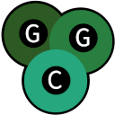

# guagacode

## Introduction
Guagacode (/ɡwɑ.ɡə.koʊd/) is a procedural programming language made for a
YouTube tutorial series. This language implements a custom preprocessor, lexer,
parser, and C code generation.

## Build requirements
* gcc/clang
* make

## Contribution guidelines
I will not be accepting pull requests.
